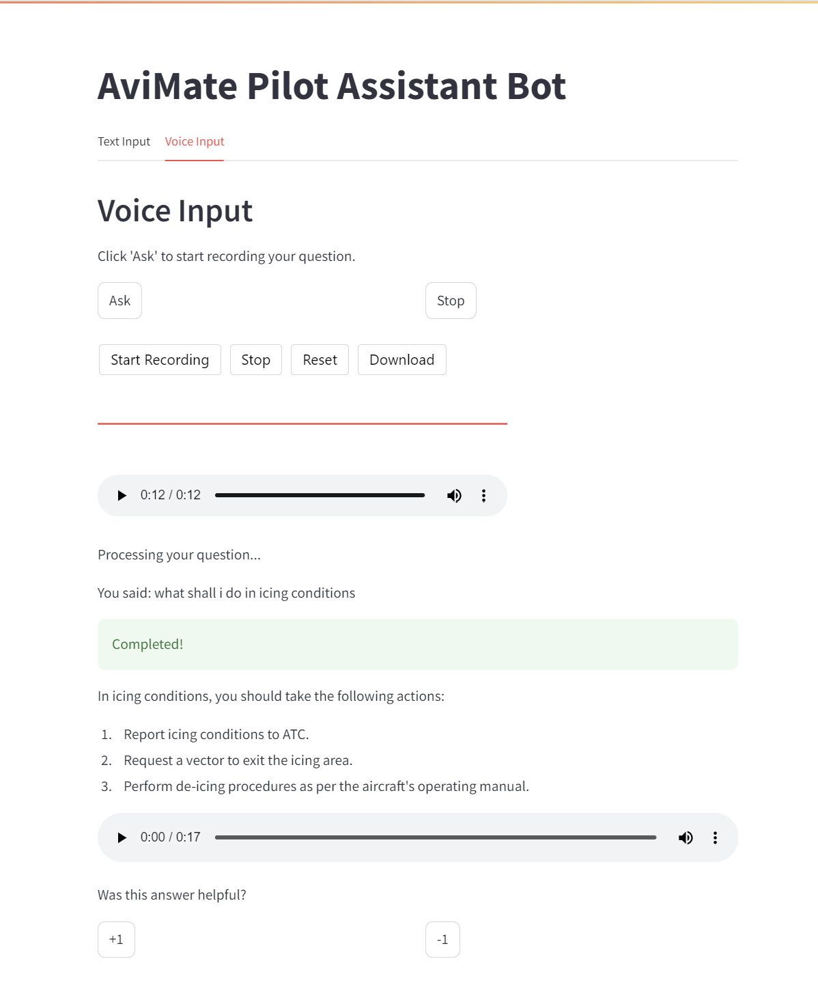
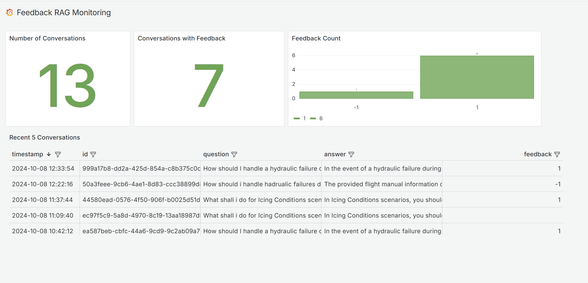

# AviMate-LLM

### Introduction

```AviMate``` a Pilot Cockpit Assistance GEN AI Tool involves creating an application that aids pilots by summarizing Flight manuals, Air Traffic Control (ATC) communications and providing relevant flight information in real-time. This tool aims to enhance situational awareness, reduce workload, and improve safety during flight operations.


<p align="center">
  
</p>


To see a demo of the project check this video:
<p align="center">
  <a href="https://www.youtube.com/watch?v=-1crEgOXYQ0&ab_channel=AkshayNimbalkar">
    
  </a>
</p>


## Project overview

AviMate a pilot Assistant is a RAG application designed to assist
captains in their flight duration.

The main use cases include:

1.  Flight Performance Monitoring and Feedback: AviMate tracks various flight manual procedures, performance metrics, such as speed, altitude, fuel consumption, and engine performance. 
2.  Communication Support with Air Traffic Control (ATC):  AviMate assists pilots in maintaining clear and efficient communication with ATC.
3. Emergency Procedure Assistance:  In the event of an in-flight emergency, AviMate provides step-by-step guidance tailored to the specific situation. Whether it's an engine failure, navigation system malfunction, or medical emergency, AviMate offers actionable instructions to help pilots manage and mitigate the crisis effectively.
4. Conversational Interaction: Making it easy to get information without remembering.
etc.

## Dataset

The dataset used in this project contains information about
flight_manuals, flight_performance, atc_communications, weather_predictions etc
you can find the data inside the data folder.

The dataset was generated using ChatGPT and contains 300 flight manual records. It serves as the foundation for the Pilot Assistant RAG Application.


## Technologies

- Python 3.11
- Docker and Docker Compose for containerization
- ElasticSearch for full-text search
- Flask as the API interface (see [Background](#background) for more information on Flask)
- Grafana for monitoring and PostgreSQL as the backend for it
- OpenAI as an LLM
- streamlit as a web interference

## Preparation

Since we use OpenAI, you need to provide the API key:

1. Install `direnv`. If you use Ubuntu, run `sudo apt install direnv` and then `direnv hook bash >> ~/.bashrc`.
2. Copy `.envrc_template` into `.envrc` and insert your key there.
3. For OpenAI, it's recommended to create a new project and use a separate key.
4. Run `direnv allow` to load the key into your environment.


Create Venv with python 3.11

### Install below dependancies and activate the venv
```bash
pipenv --python 3.11
pipenv install ipython openai scikit-learn pandas flask streamlit
pipenv shell
```

### Install Development depencies
```bash
pipenv install elasticsearch openpyxl --dev
pipenv install spacy dateparser --dev
pipenv run python -m spacy download en_core_web_sm
pipenv install sentence-transformers --dev
pipenv install openai-whisper --dev
pipenv install SpeechRecognition --dev
pipenv install streamlit-audiorecorder --dev
```

### RUn the Elastic Search with Docker
```bash
docker run -it \
    --rm \
    --name elasticsearch \
    -p 9200:9200 \
    -p 9300:9300 \
    -e "discovery.type=single-node" \
    -e "xpack.security.enabled=false" \
    docker.elastic.co/elasticsearch/elasticsearch:8.4.3
```
### OR you can also run Elastic Search using Docker-compose.yaml file.
```bash
docker-compose up

### Running the ollama Model
#### Pulling the model using service-name from the docker-compose.yaml file
```bash
docker-compose exec ollama bash
ollama pull phi3
```


## Experiments

For experiments, we use Jupyter notebooks.
They are in the [`notebooks`](notebooks/) folder.

To start Jupyter, run:

```bash
cd notebooks
pipenv run jupyter notebook
```

We have the following notebooks:

- [`rag-test.ipynb`](notebooks/rag-test.ipynb): The RAG flow and evaluating the system.
- [`evaluation-data-generation.ipynb`](notebooks/evaluation-data-generation.ipynb): Generating the ground truth dataset for retrieval evaluation.
- [`evaluate-vector-retrieval.ipynb`](notebooks/evaluate-vector-retrieval.ipynb): Elastic serach result evaluation.
- [`rag-evaluation.ipynb`](notebooks/rag-evaluatation.ipynb): to evaluate the LLM answers by LLM as a Judge approach.


## Retrieval Evaluation

The basic approach - using `ElasticSearch` without any boosting - gave the following metrics:

    - Hit Rate: 0.550
    - MRR: 0.259

The improved version (with tuned boosting): Boosts: {'text': 1.22, 'scenario': 2.81, 'manual_section': 1.95, 'instructions': 2.61}
    - Hit Rate: 0.550
    - MRR: 0.259


## RAG Evaluation
* Offline Evaluation and Online Evaluation

1. Offline Evaluation: for each question from the ground truth data, answers have generated and classified as NON_RELEVANT" | "PARTLY_RELEVANT" | "RELEVANT using gpt-4o-mini and data is stored in [`flight-manuals-evaluations-qa.csv`](data/flight-manuals-evaluations-qa.csv). Classification carried out by LLM as a Judge approach.
 - out of 150 answers, 149 are classified Relevant answer to the given question.

2. Online Evaluation: Added +1 and -1 buttons for the relevant/irrelevent responses. User Feedback and conversations data is stored in the Postgres databse.


### Streamlit

We use Streamlit for creating the WEB interference for our application. 
```bash
streamlit run app.py
```
<p align="center">
  
</p>


### Grafana
add grafana in docker-compose.yaml
```bash
docker-compose up -d grafana
```
Go to http://localhost:3000.
Enter the default credentials (admin / admin) and follow the prompt to change the password.

click Add datasource postgres:
Host: postgres:5432 (This is the service name defined in your Docker Compose)
Database: ${POSTGRES_DB} (Replace with your actual database name)
User: ${POSTGRES_USER} (Replace with your actual username)
Password: ${POSTGRES_PASSWORD} (Replace with your actual password)
SSL Mode: Disable (Change based on your security requirements

use below URL to access the public dashboard.
http://localhost:3000/public-dashboards/c600f179721049098fac390df75346d0

<p align="center">
  
</p>


### Deploy using Docker-Compose:
 run the application using:
 ```bash
docker-compose -up
 ```


